# thesis-figure-skill

> Claude Skill: Paste thesis text or upload images, automatically generate publication-quality figures (LaTeX/TikZ + draw.io)

A Skill for [Claude](https://claude.ai) that lets AI automatically transform academic paper text into high-quality figures. Supports two output formats:

- **LaTeX/TikZ**: Ideal for system architecture diagrams, data flow diagrams, geometric illustrations, and other structured charts that can be directly embedded in papers
- **draw.io XML**: Ideal for research roadmaps, academic presentations, and decorative-rich diagrams with gradient colors, shadows, and free-form layouts

> Input thesis text/image -> Automatically generate code -> Compile and verify -> High-quality delivery

## Gallery

| System Architecture | Sequence Interaction | Comparison Diagram |
|:---:|:---:|:---:|
| 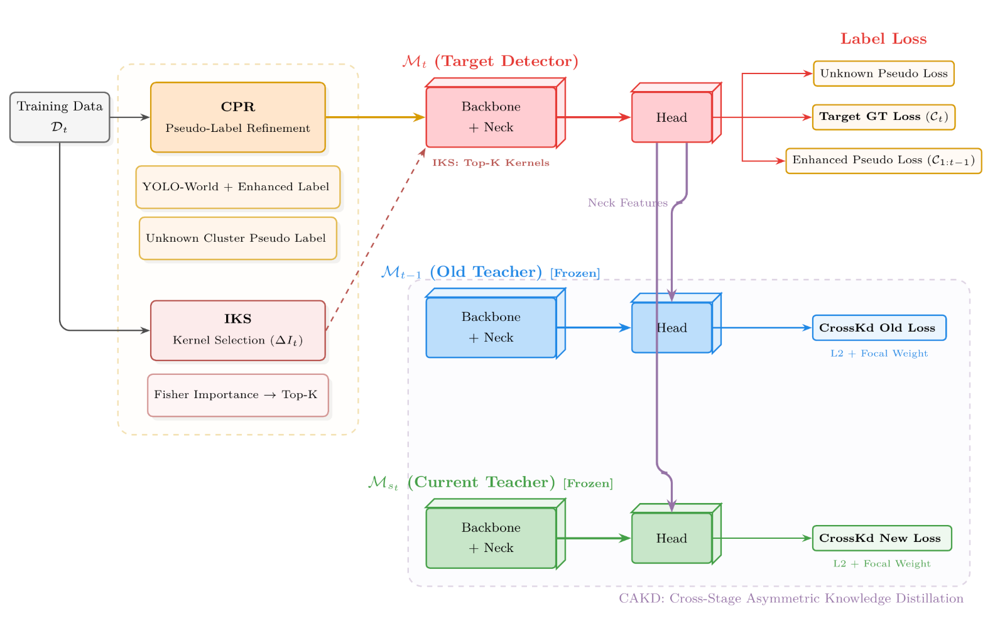 | 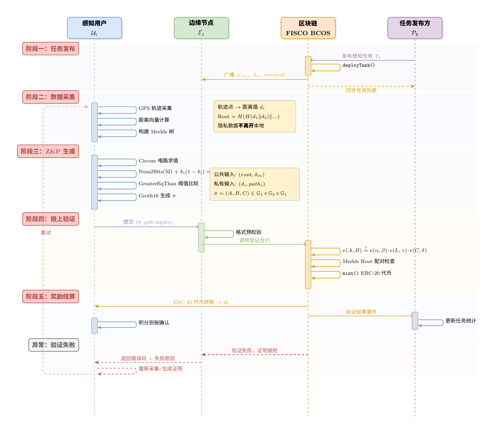 | 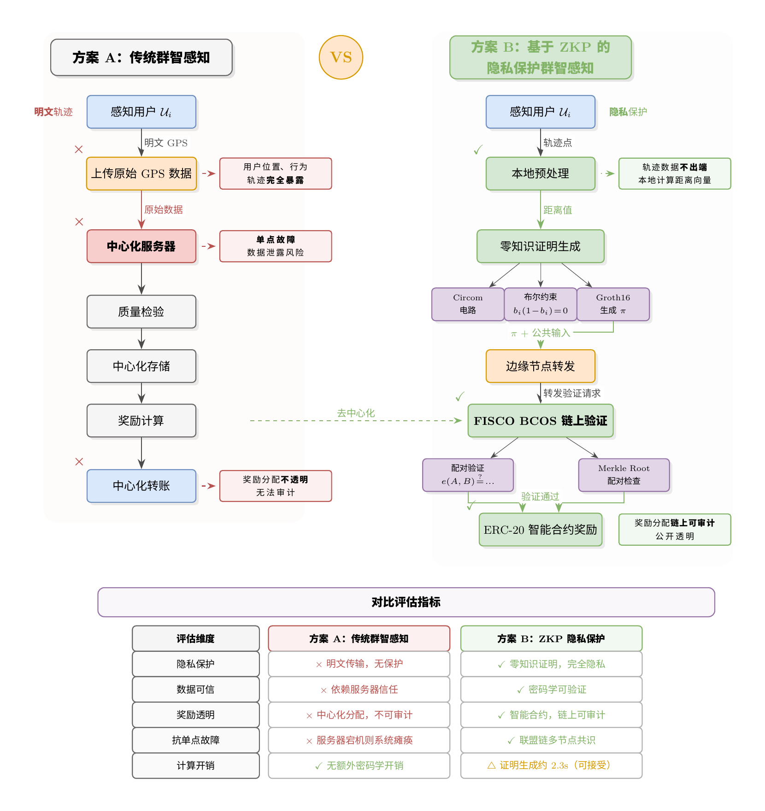 |

| Data Pipeline | Research Roadmap | Geometry/Math Diagram |
|:---:|:---:|:---:|
| 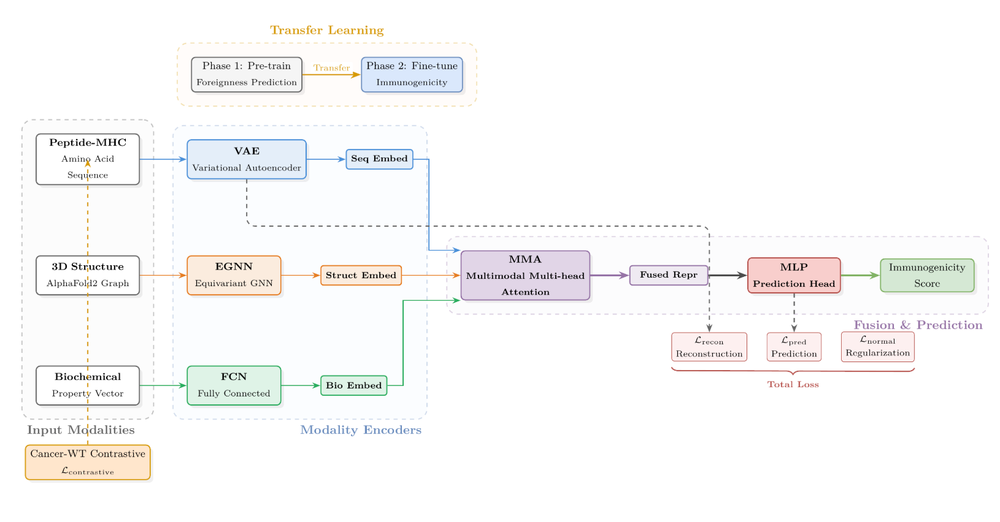 | 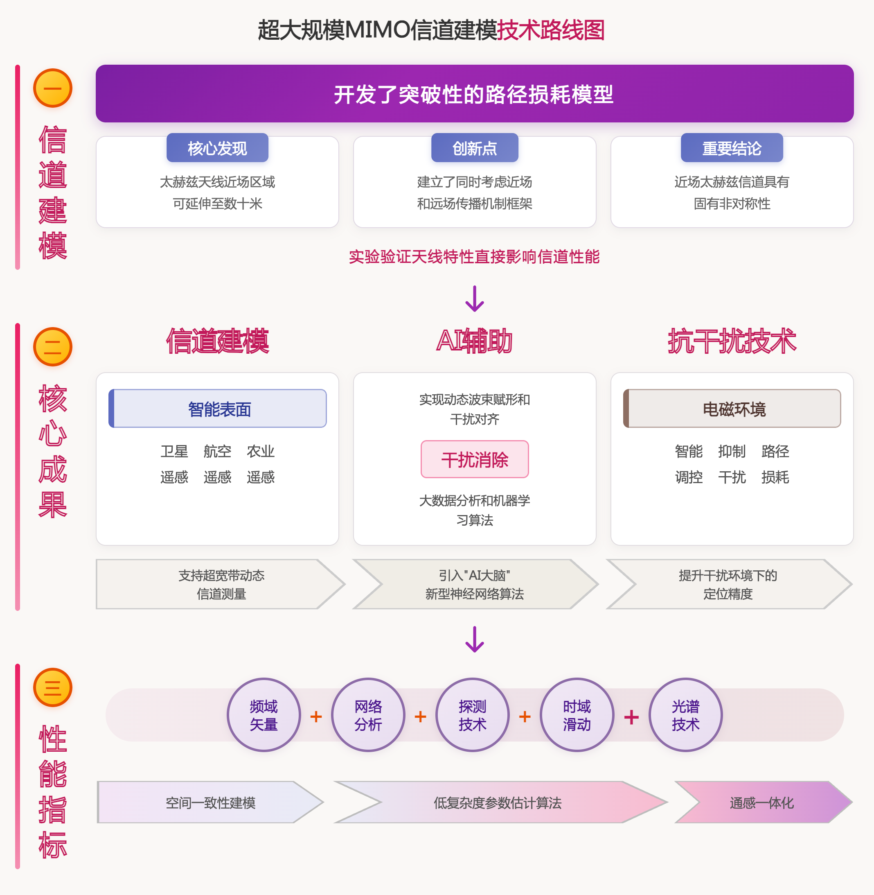 | 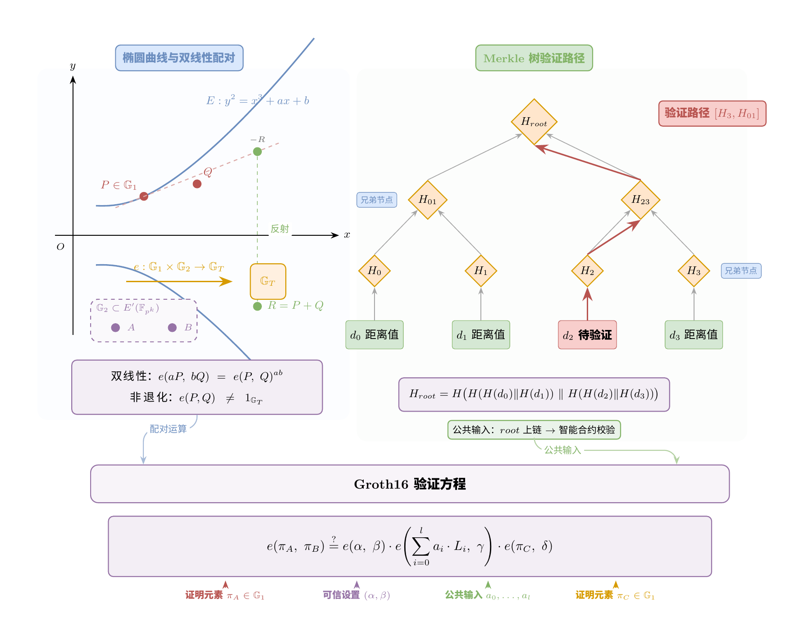 |

| Computation Pipeline | Layered Architecture | Research Framework |
|:---:|:---:|:---:|
| 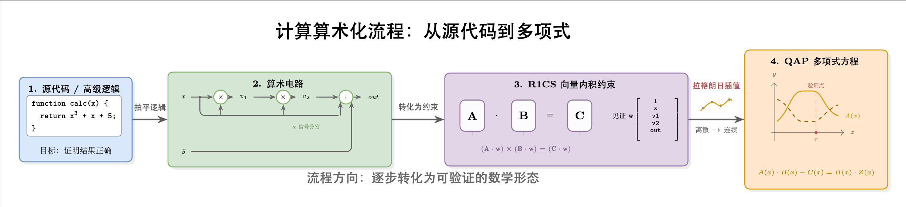 | 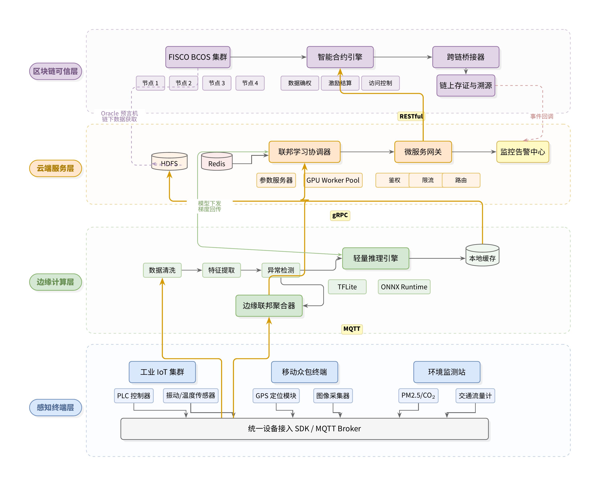 | 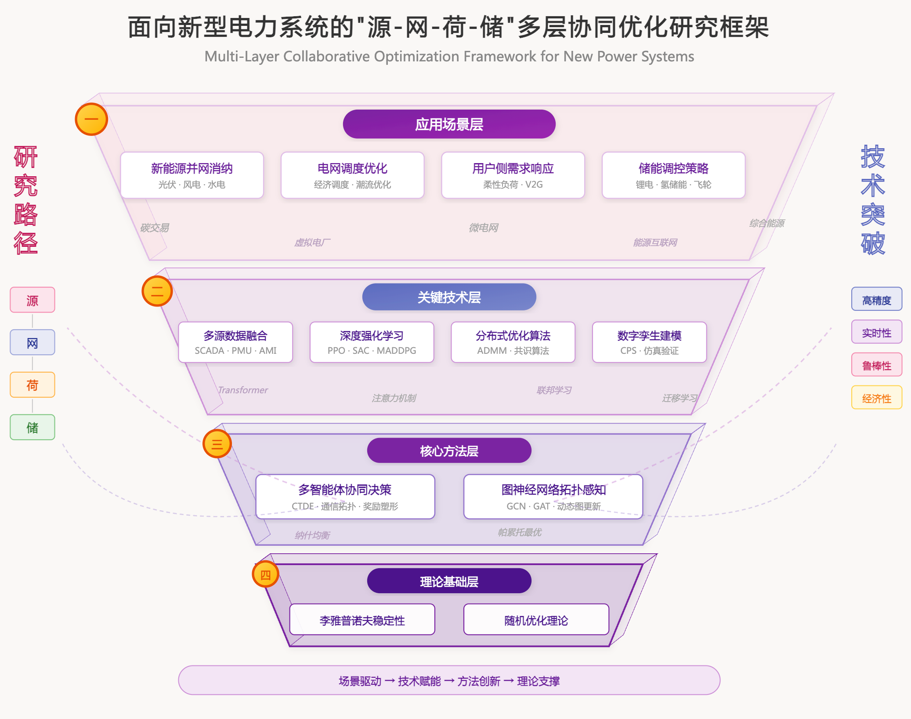 |

| Layered Roadmap (draw.io) | Compiler Optimization Pipeline | Sidebar + Center Nested (draw.io) |
|:---:|:---:|:---:|
| 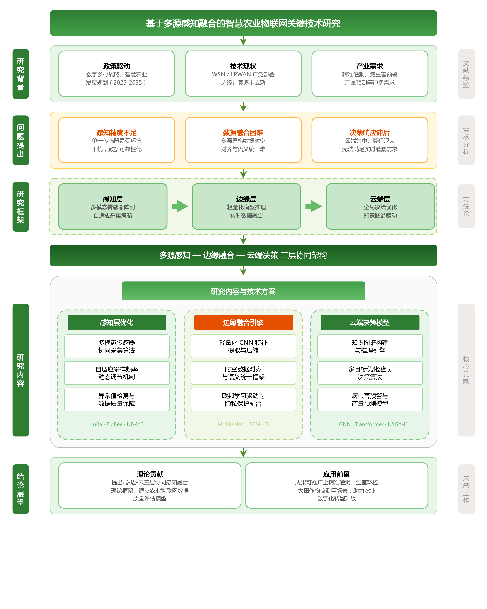 | 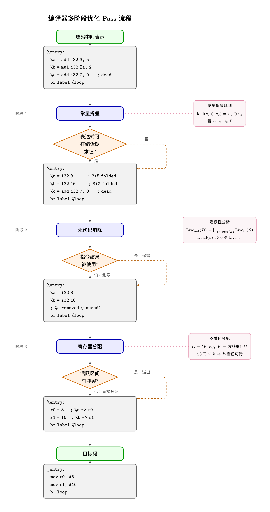 | 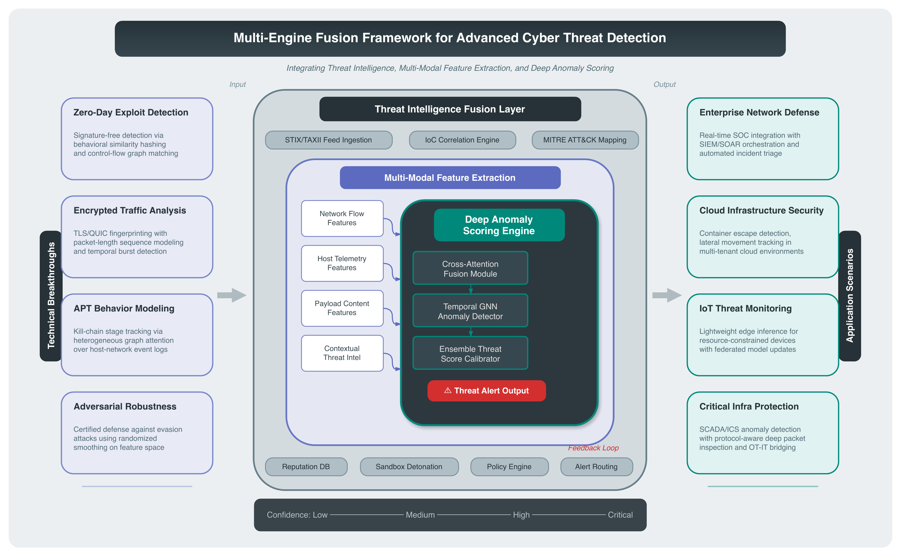 |

> All examples above were automatically generated by this Skill, including the full pipeline of compilation verification, rendering review, and automatic scoring.

## Features

- **Dual-Format Output**: TikZ for paper embedding + draw.io for free editing, choose as needed
- **Text-Driven**: Paste a thesis paragraph, automatically analyze the content to generate drawing instructions, then convert to code
- **Image-Driven**: Upload an existing screenshot, automatically recreate it as editable code
- **Domain-Adaptive**: Automatically identifies the paper's field and designs figures from a domain expert's perspective
- **Unified Color Schemes**: TikZ includes a built-in 6-color academic palette; draw.io provides 4 domain-themed palettes (Academic Blue-Gray / Pink-Purple Gradient / Green Nature / Tech Dark), automatically selected based on the paper's field
- **12+ Diagram Types**: Layered architecture, sequence, comparison, pipeline, three-column mapping, geometry/math, multi-instance convergence, circuit schematic, hybrid, draw.io roadmap, and more
- **Compile + Render Review + Auto-Scoring**: After generation, automatically compiles, converts to PNG, performs visual review based on rendered images (not code review), scores across six dimensions, and iterates if not perfect
- **Designer-Level Review**: Three-pass review method (overall impression -> element-by-element -> connection paths), spatial reasoning like a human, detecting overlap/collision/unnatural layouts
- **CJK Support**: Native support for Chinese labels, with automatic CJK font detection across platforms (macOS PingFang SC / Linux Noto Sans CJK SC / Windows SimHei)
- **Drawing Philosophy-Driven**: Four-step thinking cycle (define success criteria -> choose starting point -> in-process validation -> completion judgment), countering model inertia
- **Progressive Rule Loading**: Core rules stay loaded, specialized rules load on demand by diagram type, saving context tokens
- **Automatic Experience Logging**: Lessons learned during drawing are automatically recorded and reused, making each subsequent session smoother

## Installation

### Method 1: Command Line Installation (Recommended)

```bash
npx skills add 0xE1337/thesis-figure-skill
```

### Method 2: Upload Installation

Download the [`thesis-figure-skill.skill`](thesis-figure-skill.skill) file, upload it in a Claude conversation, and click **"Copy to your skills"**.

### Method 3: Manual Installation

Place the `skills/thesis-figure-skill/SKILL.md` file into Claude's skills directory.

## Usage

After installation, simply say in a Claude conversation:

```
Draw an architecture diagram based on the following thesis content:

This paper proposes a privacy-preserving framework based on federated learning with a three-layer structure:
the bottom layer consists of local training nodes distributed across hospitals... (paste thesis paragraph)
```

Or upload an existing image:

```
Recreate this diagram using TikZ
(attach screenshot)
```

Or specify the draw.io format:

```
Draw a research roadmap in draw.io format
(paste thesis content)
```

> **Note**: The first run requires installing fonts and the TeX compilation environment, which takes longer. Please be patient. Subsequent runs will reuse the previously created environment.

Claude will automatically:
1. Identify the paper's field
2. Select the appropriate output format (TikZ / draw.io)
3. Generate detailed drawing instructions
4. Output complete code
5. Compile and verify (TikZ) or generate editable files (draw.io)
6. Auto-score, iterating if below standard
7. Deliver the final files

## Output Format Comparison

| Scenario | Recommended Format | Reason |
|----------|-------------------|--------|
| Embedding in LaTeX papers, with math formulas, structured charts | **TikZ** | Controllable compilation, precise formulas |
| Research roadmaps, academic presentations, decoration-rich (gradients/shadows) | **draw.io** | Better visual effects, drag-and-drop editing |
| User explicitly specifies | Follow user's request | -- |

## Supported Diagram Types

| Type | Layout | Use Cases |
|------|--------|-----------|
| System Architecture | Vertical layering | Device -> Cloud -> Chain, Hardware -> Middleware -> Application |
| Sequence Interaction | Multi-column lifelines | Multi-party protocol interaction, handshake flows |
| Comparison Diagram | Side-by-side | Original vs. improved approach |
| Data Pipeline | Horizontal multi-stage | Data processing pipelines |
| Hub-Spoke Diagram | Radial layout | Microservice architecture, core module interactions |
| Data Flow Diagram | Top-down | Input -> Processing -> Output |
| Research Roadmap | Multi-layer blocks | Research frameworks, technical solution overviews |
| Layered Research Roadmap | Multi-layer blocks | Thesis roadmaps, proposal reports (draw.io Mode F) |

## Color Schemes

Built-in draw.io style color scheme, suitable for academic papers:

| Color | Fill | Border | Typical Usage |
|-------|------|--------|---------------|
| Blue | `#DAE8FC` | `#6C8EBF` | General modules, base layer |
| Green | `#D5E8D4` | `#82B366` | Core modules, security components |
| Orange | `#FFE6CC` | `#D79B00` | Data flow, emphasis elements |
| Purple | `#E1D5E7` | `#9673A6` | High-level abstractions, decision layer |
| Red | `#F8CECC` | `#B85450` | Critical operations, warnings |
| Gray | `#F5F5F5` | `#666666` | Auxiliary services, storage |

### draw.io Domain Color Schemes

Automatically selected based on the paper's field:

| Scheme | Name | Applicable Fields |
|--------|------|-------------------|
| A | Academic Blue-Gray | Computer science, engineering, general academic |
| B | Pink-Purple Gradient | Biomedical, psychology |
| C | Green Nature | Environmental science, agriculture, ecology |
| D | Tech Dark | Cybersecurity, blockchain, hardware |

## Example Files

The `examples/` directory contains 12 examples covering various academic diagram types:

1. **System Architecture** -- Blockchain/cloud/edge/perception four-layer architecture, federated learning + microservice gateway
2. **Sequence Interaction** -- Microservice discovery and registration, segmented activation bars showing busy/idle alternation, with alt combo fragment
3. **Comparison Diagram** -- Traditional crowdsensing vs. ZKP-based privacy protection, side-by-side layout + evaluation metrics
4. **Data Pipeline** -- Point cloud 3D object detection, LiDAR -> voxelization -> 3D backbone -> BEV detection, with tree fan-out and skip connections
5. **Research Roadmap** -- Massive MIMO channel modeling technical roadmap, multi-layer block layout
6. **Geometry/Math Diagram** -- 2D lattice space geometry, LLL reduction algorithm vector visualization + Gram-Schmidt orthogonalization formulas
7. **Computation Pipeline** -- Source code -> arithmetic circuit -> R1CS -> QAP polynomials, arithmetization flow
8. **Layered Architecture** -- IoT federated learning system, sensing terminals -> edge computing -> cloud services -> blockchain trust layer
9. **Research Framework** -- Source-network-load-storage multi-layer collaborative optimization, funnel-shaped four-layer research architecture
10. **Layered Research Roadmap (draw.io Mode F)** -- Smart agriculture IoT technical roadmap, Green Nature color scheme, research background -> problem statement -> research framework -> research content -> conclusions and outlook
11. **Compiler Optimization Pipeline** -- Multi-stage optimization pass flow, source IR -> constant folding -> dead code elimination -> register allocation -> target code, with code blocks and diamond decision nodes
12. **Sidebar + Center Nested (draw.io Mode D)** -- Cybersecurity threat detection framework, technical breakthrough sidebar + multi-layer nested core engine + application scenario sidebar, Tech Dark color scheme

## Requirements

This Skill runs within Claude Code and automatically handles the compilation environment. For local compilation of TikZ examples:

- TeX Live (with `xelatex`)
- CJK Chinese fonts (macOS includes PingFang SC, Linux requires Noto Sans CJK SC, Windows uses SimHei)
- ctex package
- poppler-utils (for PDF to PNG conversion)
- draw.io Desktop (optional, for draw.io format export)

### macOS (Recommended)

```bash
# Install TeX Live
brew install --cask mactex-no-gui
# Install poppler (provides pdftoppm)
brew install poppler
# Install draw.io Desktop (optional, for draw.io format export)
brew install --cask drawio

# Compile TikZ
xelatex -interaction=nonstopmode example.tex
# Convert to PNG (300dpi)
pdftoppm -png -r 300 example.pdf preview
```

> macOS includes PingFang SC font by default; no additional Chinese font installation is needed.

### Ubuntu/Debian

```bash
sudo apt-get install texlive-xetex texlive-lang-chinese fonts-noto-cjk poppler-utils
# Compile
xelatex -interaction=nonstopmode example.tex
# Convert to PNG
pdftoppm -png -r 300 example.pdf preview
```

draw.io format files can be opened and edited directly at [app.diagrams.net](https://app.diagrams.net), or exported to PDF/PNG using draw.io Desktop.

## License

MIT License
