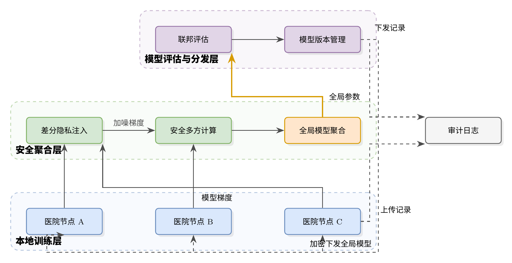
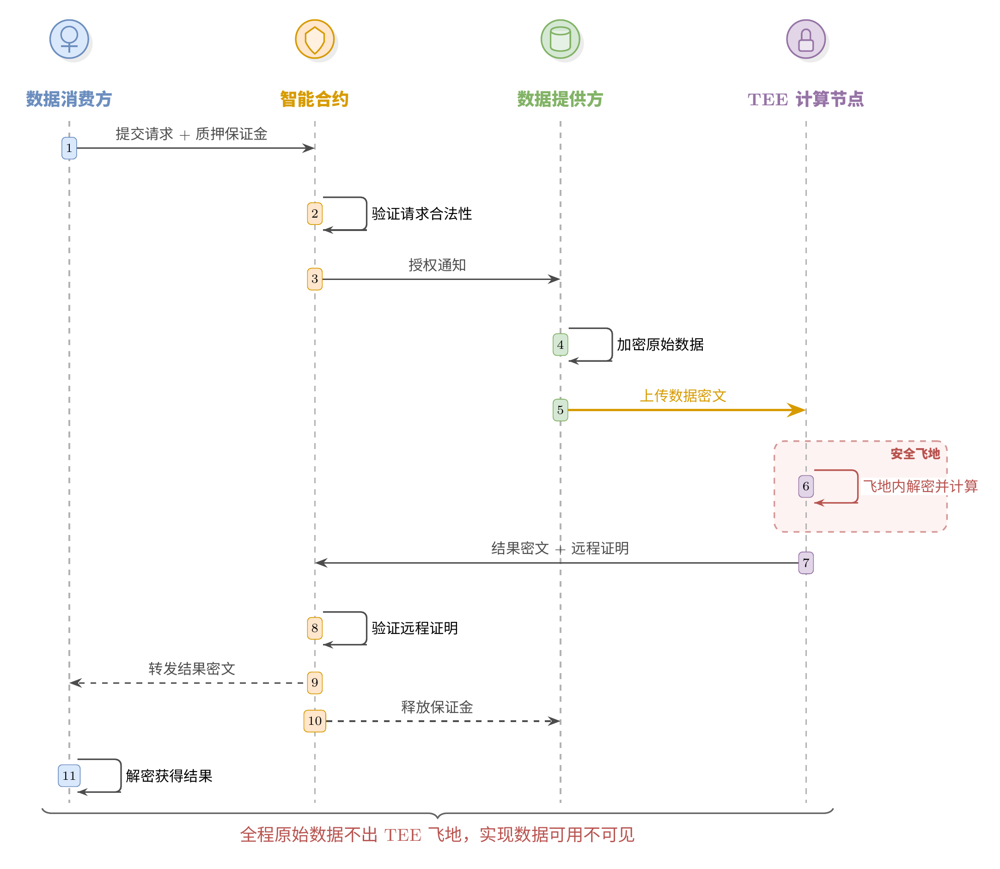
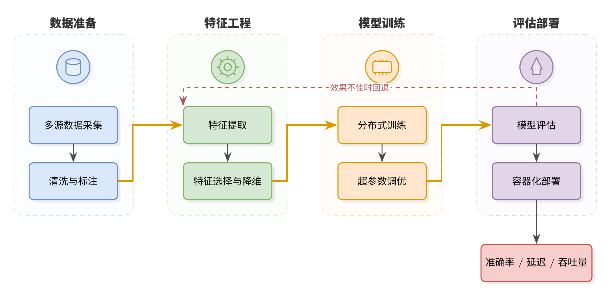
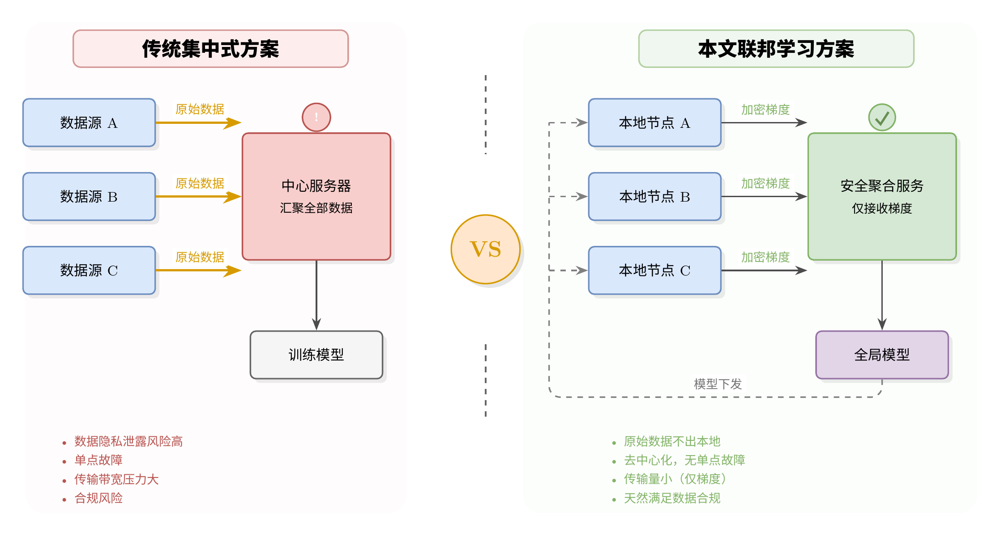
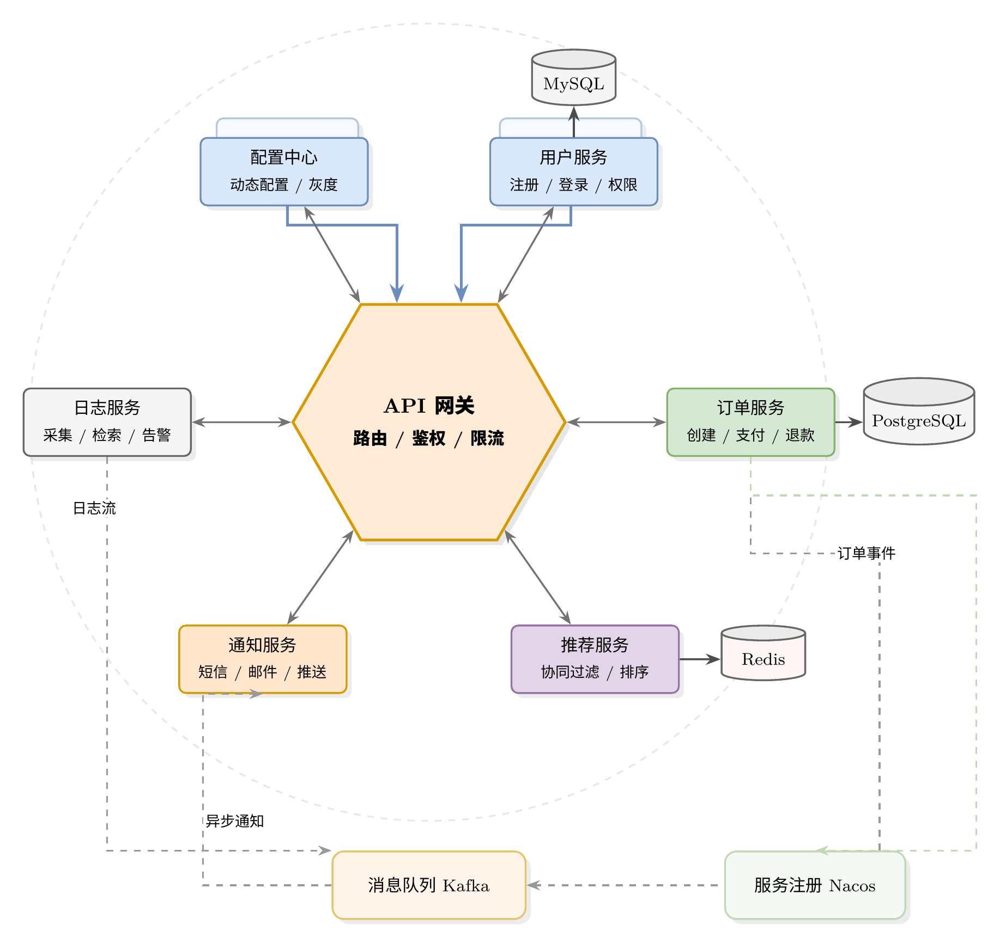

# thesis-figure-skill

> 🎓 Claude Skill：粘贴论文文案，自动生成学术级 LaTeX/TikZ 配图

一个用于 [Claude](https://claude.ai) 的 Skill，让 AI 自动将学术论文文案转化为高质量 LaTeX/TikZ 配图。

> 输入论文文字 → 自动生成 TikZ 代码 → 编译输出高清 PNG + .tex 源文件

## 效果展示

| 垂直分层架构图 | 时序交互图 |
|:---:|:---:|
|  |  |
| **数据流水线图** | **左右对比图** |
|  |  |
| **中心辐射架构图** | |
|  | |

## 特性

- **文案驱动**：粘贴论文段落，自动分析内容生成画图指令，再转化为 TikZ 代码
- **图片驱动**：上传已有截图，自动复刻为可编辑的 TikZ 代码
- **领域自适应**：自动识别论文所属学科，以该领域专家视角设计配图
- **统一配色**：内置 6 色学术配色方案（蓝/绿/橙/紫/红/灰），全篇视觉一致
- **多种图表类型**：支持分层架构图、时序图、对比图、流水线图、中心辐射图、数据流转图等
- **编译验证 + 自动评分**：生成后自动编译验证、13 项缺陷扫描、6 维度评分，不满分自动迭代修改
- **中文优先**：原生支持中文标签，自动处理字体配置（ctex / ucharclasses 双方案）

## 安装

### 方法一：一键安装（推荐）

下载 [`thesis-figure-skill.skill`](thesis-figure-skill.skill) 文件，在 Claude 对话中上传，点击 **"Copy to your skills"** 即可。

### 方法二：手动安装

将 `SKILL.md` 文件放入 Claude 的 skills 目录。

## 使用方式

安装后，在 Claude 对话中直接说：

```
帮我根据以下论文内容画一张架构图：

本文提出一种基于联邦学习的隐私保护框架，包含三层结构：
底层为分布在各医院的本地训练节点...（粘贴论文段落）
```

或者上传一张已有的图片：

```
帮我用 TikZ 复刻这张图
（附上截图）
```

Claude 会自动：
1. 识别论文领域
2. 生成详细画图指令
3. 输出完整 .tex 代码
4. 编译生成高清 PNG 预览
5. 自动评分，不达标则迭代修改
6. 交付 .tex + .png 文件

## 支持的图表类型

| 类型 | 布局 | 适用场景 |
|------|------|---------|
| 系统架构图 | 垂直分层 | 端→云→链、硬件→中间件→应用 |
| 时序交互图 | 多列生命线 | 多方协议交互、握手流程 |
| 对比方案图 | 左右并列 | 原有 vs 改进方案 |
| 数据流水线图 | 水平多阶段 | 数据处理流水线 |
| 中心辐射图 | 环形布局 | 微服务架构、核心模块交互 |
| 数据流转图 | 自上而下 | 输入→处理→输出 |

## 配色方案

内置 draw.io 风格配色，适合学术论文：

| 颜色 | 填充色 | 边框色 | 典型用途 |
|------|--------|--------|---------|
| 蓝色 | `#DAE8FC` | `#6C8EBF` | 通用模块、基础层 |
| 绿色 | `#D5E8D4` | `#82B366` | 核心模块、安全组件 |
| 橙色 | `#FFE6CC` | `#D79B00` | 数据流、强调元素 |
| 紫色 | `#E1D5E7` | `#9673A6` | 高层抽象、决策层 |
| 红色 | `#F8CECC` | `#B85450` | 关键操作、警告 |
| 灰色 | `#F5F5F5` | `#666666` | 辅助服务、存储 |

## 示例文件

`examples/` 目录包含 5 张完整示例，每张都有 `.tex` 源码和 `.png` 预览：

1. **联邦学习架构图** — 三层分层 + 回路箭头 + 独立审计模块
2. **跨域数据共享时序图** — 四方生命线 + 手绘图标 + TEE 安全飞地高亮
3. **ML 训练流水线** — 四阶段 + 手绘图标 + 反馈回路
4. **传统 vs 联邦学习对比** — VS 分隔 + 红绿对比 + 优劣列表
5. **微服务架构** — 六边形网关 + 环形服务 + 数据库/消息队列

## 环境要求

本 Skill 在 Claude.ai 中运行，自动处理编译环境。如需本地编译示例：

- TeX Live（含 `xelatex`）
- Noto Sans CJK SC 字体
- ctex 宏包（`texlive-lang-chinese`）或 ucharclasses 宏包

```bash
# Ubuntu/Debian
sudo apt-get install texlive-xetex texlive-lang-chinese fonts-noto-cjk poppler-utils
# 编译
xelatex -interaction=nonstopmode example.tex
# 转 PNG
pdftoppm -png -r 300 example.pdf preview
```

## 许可证

MIT License
